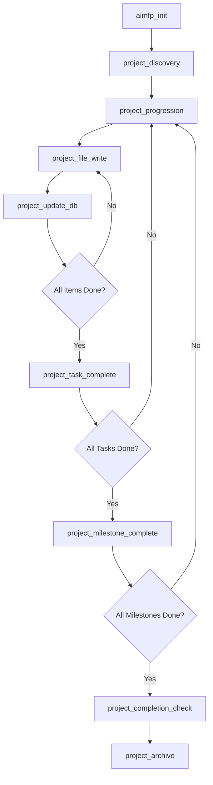

# AIMFP: AI Modular Functional Procedural Programming

[](https://pypi.org/project/aimfp/)

> **A language-agnostic programming paradigm designed for AI-generated and AI-maintained codebases**

---

## Table of Contents

- [What is AIMFP?](#what-is-aimfp)
- [Core Principles](#core-principles)
- [Architecture Overview](#architecture-overview)
- [Database Architecture](#database-architecture)
- [How It Works](#how-it-works)
- [Getting Started](#getting-started)
- [Directives System](#directives-system)
- [Project Lifecycle](#project-lifecycle)
- [Example Workflow](#example-workflow)
- [Documentation](#documentation)
- [Development](#development)
- [Design Philosophy](#design-philosophy)
- [Features](#features)
- [Usage Examples](#usage-examples)
- [Privacy Policy](#privacy-policy)
- [Support](#support)
- [License](#license)

---

## What is AIMFP?

**AIMFP (AI Modular Functional Procedural)** is a programming paradigm that combines:

- **Pure functional programming** principles (referential transparency, immutability, composability)
- **Procedural execution** patterns (explicit sequencing, no hidden state)
- **Database-driven project management** (persistent state, instant context retrieval)
- **Directive-based AI guidance** (deterministic workflows, automated compliance)

### Two Ways to Use AIMFP

**Use Case 1: Regular Software Development**
- Build applications (web apps, libraries, CLI tools, etc.)
- AIMFP enforces FP compliance and manages your project
- You write code, AI assists with FP standards and project tracking
- Example: Building a web server, calculator library, data processor

**Use Case 2: Custom Directive Automation**
- Define automation rules (home automation, cloud management, workflows)
- **AIMFP generates and manages the automation codebase for you**
- You write directive definitions (YAML/JSON/TXT), AI generates the implementation
- The project's code IS the automation code generated from your directives
- Example: Smart home control system, AWS infrastructure manager, workflow automator

**Key Principle**: One AIMFP instance per project directory. You would NOT mix a web app with home automation directives. Run separate instances for separate purposes.

### Why AIMFP?

Traditional programming paradigms were designed for humans. AIMFP is optimized for **AI-human collaboration**:

| Challenge | Traditional Approach | AIMFP Solution |
|-----------|---------------------|---------------|
| **Context Loss** | AI forgets between sessions | Database-driven persistent state |
| **OOP Complexity** | Classes, inheritance, polymorphism | Pure functions, explicit data structures |
| **Infinite Development** | Projects never "complete" | Finite completion paths with milestones |
| **Code Reasoning** | Parse source code repeatedly | Pre-indexed functions, dependencies, interactions |
| **Inconsistent Standards** | Style guides, linters, reviews | Immutable directives enforcing compliance |

---

## Core Principles

### 1. Functional-Procedural Hybrid

```python
# ✅ AIMFP-Compliant
def calculate_total(items: List[Item]) -> float:
    """Pure function: deterministic, no side effects"""
    return reduce(lambda acc, item: acc + item.price, items, 0.0)

# ❌ Not AIMFP-Compliant
class Calculator:
    def __init__(self):
        self.total = 0  # Hidden state

    def add_item(self, item):
        self.total += item.price  # Mutation
```

### 2. Database-Indexed Logic

Every function, file, and dependency is tracked in SQLite. AI accesses this data through helper tools — not raw SQL:

```
AI calls: get_functions_by_file(file_id)
→ Returns: all functions in that file with name, purpose, parameters, returns
```

No source code reparsing required. Instant context retrieval across sessions.

### 3. AI-Readable Code

- **Flat structure**: No deep inheritance hierarchies
- **Explicit dependencies**: All parameters passed explicitly
- **Pure functions**: Same inputs → same outputs
- **Metadata annotations**: Machine-readable function headers

### 4. Finite Completion Paths

```
Project: MatrixCalculator
├── Completion Path (3 stages)
│   ├── 1. Setup (completed)
│   ├── 2. Core Development (in progress)
│   │   ├── Milestone: Matrix Operations
│   │   │   ├── Task: Implement multiply
│   │   │   ├── Task: Implement transpose
│   │   │   └── Task: Add validation
│   │   └── Milestone: Vector Operations
│   └── 3. Finalization (pending)
```

### 5. Language-Agnostic

AIMFP works with Python, JavaScript, TypeScript, Rust, Go, and more. FP directives adapt to language-specific syntax while maintaining universal standards.

---

## Architecture Overview

```
┌─────────────────────────────────────────────────────┐
│            AI Assistant (Claude, GPT-4, etc.)        │
│  - Receives natural language commands                │
│  - Follows directives (FP baseline + project mgmt)   │
│  - Calls MCP tools to read/write databases           │
│  - Generates FP-compliant code                       │
└────────────────────┬────────────────────────────────┘
                     │ MCP Protocol (JSON-RPC over stdio)
┌────────────────────▼────────────────────────────────┐
│                 MCP Server                           │
│  - Exposes helper tools via JSON-RPC                  │
│  - Manages four-database connections                 │
│  - Provides CRUD helpers for all databases           │
│  - No business logic — AI makes all decisions        │
└───┬────────────────────┬─────────────────────────┬──┘
    │                    │                         │
┌───▼──────────────┐ ┌───▼────────────────┐ ┌─────▼─────────────────┐ ┌──────▼────────────────┐
│  aimfp_core.db    │ │  project.db        │ │  user_preferences.db  │ │  user_directives.db   │
│  (Global,        │ │  (Per-Project,     │ │  (Per-Project,        │ │  (Per-Project,        │
│   Read-Only)     │ │   Mutable)         │ │   Mutable)            │ │   Optional)           │
│                  │ │                    │ │                       │ │                       │
│ - FP directives  │ │ - Project metadata │ │ - Directive prefs     │ │ - User directives     │
│ - Project mgmt   │ │ - Files & funcs    │ │ - User settings       │ │ - Execution stats     │
│ - User prefs     │ │ - Task hierarchy   │ │ - AI learning log     │ │ - Dependencies        │
│ - User systems   │ │ - Themes & flows   │ │ - Tracking features   │ │ - Generated code refs │
│ - Helper defs    │ │ - Completion path  │ │ (All opt-in)          │ │ - Source file tracking│
│ - Directive flow │ │ - Runtime notes    │ │                       │ │ (Logs in files)       │
└──────────────────┘ └────────────────────┘ └───────────────────────┘ └───────────────────────┘
```

---

## Database Architecture

### aimfp_core.db (Global, Read-Only)

**Location**: Within MCP server installation directory (user-defined location, configured in AI client)

**Purpose**: Immutable knowledge base containing all AIMFP standards, directives, and helper definitions.

**Key Tables**:
- `directives`: All FP, project, and user preference directives (workflows, keywords, thresholds)
- `helper_functions`: Database, file, Git, and FP utilities organized across multiple registry files
- `directive_helpers`: **Many-to-many junction table** mapping directives to their helper functions with execution metadata
- `categories`: Directive groupings (purity, immutability, task management, etc.)
- `directive_flow`: Status-driven directive navigation and routing

**Helper-Directive Relationship** (New in v1.4):
- One directive can use many helpers, one helper can serve many directives
- Junction table stores: execution context, sequence order, parameter mappings
- Enables flexible helper reuse and clear execution flow
- Defined in `directive_helpers` junction table in `aimfp_core.db`

**Helper Classification**:
- **Tool**: All helpers are exposed as MCP tools (AI calls directly via MCP)
- **Sub-helper** (`is_sub_helper = TRUE`): Internal utility called by other helpers only (not exposed to AI)

**Helper Registry** (Development Staging):
- Helper definitions maintained in `dev/helpers-json/*.json` during development
- Developers modify JSON files, then import to database when complete
- Each helper includes `used_by_directives` field for relationship mapping
- Database import script populates `aimfp_core.db` from JSON files before release
- Production: Users query `aimfp_core.db` (pre-populated), NOT JSON files
- JSON files are dev-only staging area, never shipped with package

**Read-Only Philosophy**: This database is version-controlled and immutable once deployed. AI reads from it but never modifies it.

### project.db (Per-Project, Mutable)

**Location**: `<project-root>/.aimfp-project/project.db`

**Purpose**: Persistent state for a single AIMFP project. Tracks code structure, tasks, and runtime notes.

**Key Tables**:
- `project`: High-level metadata (name, purpose, goals, status, user_directives_status, last_known_git_hash)
- `files`, `functions`, `interactions`: Code structure tracking
- `themes`, `flows`: Organizational groupings
- `completion_path`, `milestones`, `tasks`, `subtasks`, `sidequests`: Hierarchical roadmap
- `notes`: Runtime logging with optional directive context (source, severity, directive_name)
- `types`: Algebraic data types (ADTs)
- `infrastructure`: Project setup (language, packages, testing)
- `work_branches`: Git collaboration metadata (user, purpose, merge strategy)
- `merge_history`: FP-powered merge conflict resolution audit trail

**User Directives Integration**: The `project.user_directives_status` field tracks whether user directives are initialized (NULL/in_progress/active/disabled), allowing `aimfp_run` and `aimfp_status` directives to include user directive context when active.

**Enhanced Notes**: The `notes` table now includes `source` (user/ai/directive), `directive_name` (optional context), and `severity` (info/warning/error) for better traceability.

### user_preferences.db (Per-Project, Mutable)

**Location**: `<project-root>/.aimfp-project/user_preferences.db`

**Purpose**: User-specific AI behavior customizations and opt-in tracking features.

**Key Tables**:
- `directive_preferences`: Per-directive behavior overrides (atomic key-value structure)
- `user_settings`: Project-wide AI behavior settings
- `tracking_settings`: Feature flags for opt-in tracking (all disabled by default)
- `ai_interaction_log`: User corrections and learning data (opt-in)
- `fp_flow_tracking`: FP compliance history (opt-in)
- `issue_reports`: Contextual bug reports (opt-in)

**Cost Management Philosophy**: All tracking features disabled by default to minimize API token usage. Project work should be cost-efficient; debugging and analytics are opt-in.

**User Customization Example**:
```sql
-- User says: "Always add docstrings"
INSERT INTO directive_preferences (directive_name, preference_key, preference_value)
VALUES ('project_file_write', 'always_add_docstrings', 'true');

-- Next file write automatically includes docstrings
```

### user_directives.db (Per-Project, Optional)

**Location**: `<project-root>/.aimfp-project/user_directives.db`

**Purpose**: Store user-defined domain-specific directives for automation (home automation, cloud infrastructure, etc.). **When this database exists, the AIMFP project IS dedicated to building and managing the automation code generated from these directives.**

This database only exists in **Use Case 2: Custom Directive Automation** projects. In regular software development projects, this database is not created.

**Key Tables**:
- `user_directives`: Directive definitions (triggers, actions, status, validated configuration)
- `directive_executions`: Execution statistics (summary only, detailed logs in files)
- `directive_dependencies`: Required packages, APIs, environment variables
- `directive_implementations`: Links directives to generated code files
- `helper_functions`: **AI-generated helper functions** (project-specific implementation utilities)
- `directive_helpers`: **Many-to-many junction table** mapping user directives to their helpers
- `source_files`: Tracks user directive source files (YAML/JSON/TXT)
- `logging_config`: File-based logging configuration

**Helper Functions (New in v1.0)**:
- AI generates project-specific helper functions for user directives
- Tracked with implementation status: not_implemented → generated → tested → approved
- Enforces FP compliance (pure functions) for all generated code
- Same many-to-many relationship pattern as aimfp_core.db

**File-Based Logging Philosophy**: Database stores state and statistics only. Detailed execution logs (30-day retention) and error logs (90-day retention) are stored in rotating files at `.aimfp-project/logs/`.

**Directory Structure Comparison**:

```
# Use Case 1: Regular Software Development
my-web-app/
├── src/                    # Your application code
├── tests/                  # Your tests
└── .aimfp-project/          # AIMFP tracks your application
    ├── project.db
    └── user_preferences.db

# Use Case 2: Custom Directive Automation
home-automation/
├── directives/             # ← User writes directive files here
│   ├── lights.yaml
│   └── security.yaml
├── src/                    # ← AIMFP GENERATES this code
│   ├── lights_controller.py
│   └── security_monitor.py
├── tests/                  # ← AIMFP GENERATES tests
└── .aimfp-project/          # ← AI-managed only, user never touches
    ├── project.db          # Tracks generated src/ code
    ├── user_preferences.db
    ├── user_directives.db  # References ../directives/ files
    └── logs/               # 30/90-day execution logs
```

**Example Workflow (Automation Project)**:
1. User creates `directives/lights.yaml` in their project
2. User tells AI: "Parse my directive file at directives/lights.yaml"
3. AI parses and validates through interactive Q&A
4. AI generates FP-compliant implementation code in `src/`
5. AI tracks generated code in `project.db` (files, functions, tasks)
6. Directives execute in real-time via background services
7. Execution logs to `.aimfp-project/logs/`, statistics to database

**Note**: User directive files stay in the user's project. `.aimfp-project/` is AI-managed metadata.

---

## How It Works

### 1. AIMFP MCP Gateway Pattern

The `aimfp_run` command serves as a **gateway and reminder**, not an executor. It tells the AI that AIMFP directives should be applied.

**Every `aimfp_run` call returns**:
```json
{
  "success": true,
  "message": "AIMFP MCP available",
  "guidance": {
    "directive_access": "Directive names cached from session bundle. Query specific directives by name when needed.",
    "when_to_use": "Use AIMFP directives when coding or when project management action/reaction is needed.",
    "assumption": "Always assume AIMFP applies unless user explicitly rejects it."
  }
}
```

The MCP server exposes CRUD helper functions for all database operations — tracking files, functions, tasks, project state, user preferences, and (for Use Case 2) automation directives. AI discovers available helpers from the database at runtime.

**AI Decision Flow**:
1. User prefixes request with `aimfp run` (or AI assumes it)
2. AI calls `aimfp_run` tool → receives guidance
3. AI evaluates: Is this coding or project management?
4. If yes: Check if directives are in memory
   - No directives? → Directive names cached from session bundle; query by name when needed
   - Has directives? → Apply appropriate ones
5. If no: Respond without directives

### 2. Command Flow Example

```
User: "Help me build a calculator"
```

**AI Processing**:
1. Calls `aimfp_run(is_new_session=true)` → receives session bundle (directive names, project status, settings, supportive context)
2. Checks project state from bundle: `.aimfp-project/` missing → project not initialized
3. Calls `aimfp_init` helper (Phase 1: mechanical setup)
   - Programmatically creates `.aimfp-project/` directory, databases, blueprint template
4. Enters Phase 2 (intelligent population): detects language/tools, discusses project with user
5. Routes to `project_discovery`: collaborates with user on blueprint, themes, flows, completion path, milestones
6. Discovery complete → routes to `aimfp_status` → `project_progression` → first task created
7. Work begins

### 3. Self-Assessment Framework

Before acting, AI performs self-assessment using questions provided with directives:

**Core Questions**:
1. **Does this involve coding or project state changes?**
   - Coding and project management are unified — writing code triggers file tracking, DB updates, and task progress automatically
   - FP baseline is always active as the mandatory coding style
   - Project directives handle the tracking side (file writes, DB updates, task management)

2. **Do I have directives in memory?**
   - No: Load from session bundle via `aimfp_run(is_new_session=true)`
   - Yes: Proceed with cached directives

3. **Which directives apply?**
   - FP baseline: Mandatory coding style (pure functions, immutability, no OOP) — applied naturally, not as directive calls
   - FP directives: Reference documentation only — consulted when uncertain about complex scenarios
   - Project directives: File writes, DB updates, task management

4. **Action-reaction needed?**
   - Code write → project_file_write directive → DB update
   - File edit → DB sync
   - Discussion with decision → DB update

**Example Flow (Coding Task)**:
```
User: "Write multiply_matrices function"
AI thinks:
  ✓ FP baseline applies (write pure, immutable, no OOP)
  ✓ Project tracking applies (project_file_write directive)
  ✓ I have directives in memory

AI executes:
  1. Write function following FP baseline naturally
  2. Apply project_file_write directive
  3. Update project.db (files, functions, interactions)
```

### 4. Directive Execution

Directives follow a **trunk → branches → fallback** pattern:

```json
{
  "trunk": "analyze_function",
  "branches": [
    {"if": "pure_function", "then": "mark_compliant"},
    {"if": "mutation_detected", "then": "refactor_to_pure"},
    {"if": "low_confidence", "then": "prompt_user"},
    {"fallback": "prompt_user"}
  ]
}
```

---

## Getting Started

### Prerequisites

- **Python 3.11+** (required for type hint syntax used throughout)

### Installation

AIMFP installs three ways. **On Claude Code, use the plugin (Method 1)** — two commands, no manual setup. pip/manual are for other MCP clients or advanced setups.

#### Method 1: Claude Code Plugin (Recommended for Claude Code)

**Prerequisite:** [`uv`](https://docs.astral.sh/uv/) on your PATH (a single self-contained binary). The plugin launches the MCP server with `uvx`, which fetches the published `aimfp` package from PyPI, resolves its `watchdog` dependency, and provisions a compatible Python (3.11+) automatically — so you don't need a matching system Python or a separate `pip install`.

```
/plugin marketplace add aryanduntley/aimfp
/plugin install aimfp@aimfp
```

That's it — no `pip install`, no `claude mcp add`, no config files. The plugin provides:

- the **MCP server**, launched via `uvx aimfp@latest` (always the latest published release, fully self-contained)
- **slash commands**: `/aimfp:run`, `/aimfp:status`, `/aimfp:init`, `/aimfp:end`
- a tiny **`aimfp-mode` setup skill** + a **SessionStart hook** — these are setup-only: they prompt the AI to install the system prompt (via the `get_system_prompt` tool) and start a session. They are deliberately *not* a copy of the behavioral rules (that would duplicate the system prompt into every session). Your **first move** after install is still to ask the AI to add the AIMFP system prompt — see [Add the System Prompt](#add-the-system-prompt-your-first-move) below; for the plugin the AI does it for you, nothing to download or paste.
- **session hooks** for write-tracking nudges and an end-of-session audit guard

Updates: `/plugin marketplace update aimfp`. No Anthropic account, approval, or central registry is involved — the marketplace is just this public GitHub repo.

> Tool pre-approval still applies to the plugin's MCP tools — see [Pre-Approve All AIMFP Tools](#claude-code-pre-approve-all-aimfp-tools-optional) below.

#### Method 2: pip install

```bash
pip install aimfp
```

This installs the MCP server and makes the `aimfp` command available. AIMFP requires only one external dependency (`watchdog` for filesystem monitoring) — the JSON-RPC server itself is pure Python stdlib.

#### Method 3: Manual Install (GitHub Download)

1. **Download** the repository (zip download or `git clone`)
2. **Locate** the `src/aimfp/` folder — this is the complete MCP server package
3. **Copy** the `aimfp/` folder to wherever you keep MCP servers:
   ```bash
   # Example: copy to your MCP servers directory
   cp -r src/aimfp/ ~/mcp-servers/aimfp/
   ```

The only runtime dependency (`watchdog`) is installed automatically. The `aimfp/` folder contains everything else the server needs: helper functions, directives, database schemas, and the pre-populated `aimfp_core.db`.

### Add the System Prompt (Your First Move)

**Do this before anything else.** The system prompt is AIMFP's record-keeping backbone — it's what tells the AI to call `aimfp_run()` first and run the project through AIMFP. Without it the MCP tools are just passive functions that never get called; the AI won't even know to start `init` or discovery.

**Recommended — works for every install method, including the plugin (nothing to download or paste).** Just ask the AI:

```
Add the AIMFP system prompt
```

The AI calls the `get_system_prompt` tool, which returns the prompt plus placement guidance, and writes it for you:

- It goes in `CLAUDE.md` at your project root (Claude Code) or **Settings → Custom Instructions** (Claude Desktop).
- **AIMFP content is placed first** — it's the project's backbone and must be the highest-priority instruction.
- If you already have an extensive `CLAUDE.md` / instructions file, the AI will **not** blindly prepend — it reviews it with you and discusses consolidating/optimizing first. Existing content is never discarded.
- Once it's in place, the AI offers to also set up the tool-permission allowlist — a one-time step that skips per-tool approval prompts. It only pre-approves AIMFP's own CRUD tools, which operate strictly inside `.aimfp-project/`: no network, no credentials, nothing outside your current project.

**Manual alternative** (other MCP clients, or if you'd rather paste it yourself) — print it and paste it into your client's system-prompt / custom-instructions field:

```bash
python3 -m aimfp --system-prompt
```

| AI Client | Where the system prompt goes |
|-----------|------------------------------|
| **Claude Code** | `CLAUDE.md` in your project root |
| **Claude Desktop** | Settings → Custom Instructions |
| **Other MCP clients** | System prompt / custom instructions field |

### Configure Your AI Client

Register the AIMFP MCP server in your AI client's configuration. The server uses **stdio transport** — it reads JSON-RPC messages from stdin and writes responses to stdout.

#### Claude Desktop

Edit `claude_desktop_config.json`:

```json
{
  "mcpServers": {
    "aimfp": {
      "command": "python3",
      "args": ["-m", "aimfp"],
      "env": {}
    }
  }
}
```

If you used **Method 3 (manual install)**, add the parent directory of your `aimfp/` folder to `PYTHONPATH` so Python can find it:

```json
{
  "mcpServers": {
    "aimfp": {
      "command": "python3",
      "args": ["-m", "aimfp"],
      "env": {
        "PYTHONPATH": "/path/to/parent-of-aimfp-folder"
      }
    }
  }
}
```

For example, if you copied `aimfp/` to `~/mcp-servers/aimfp/`, set `PYTHONPATH` to `~/mcp-servers`.

If you installed into a **virtual environment**, use the full path to the venv's Python so Claude Desktop uses the correct interpreter:

```json
{
  "mcpServers": {
    "aimfp": {
      "command": "/path/to/venv/bin/python3",
      "args": ["-m", "aimfp"],
      "env": {}
    }
  }
}
```

#### Claude Code

Use `claude mcp add` to register the server. Run the command **from within the project folder** you want AIMFP to manage.

**Choose a scope first.** AIMFP enforces strict functional programming and actively rejects OOP codebases. If you work on other projects that use OOP or don't need AIMFP, avoid `--scope user` — it enables the server in every project you open.

| Scope | Effect | Best for |
|---|---|---|
| `--scope project` (Recommended) | Creates `.mcp.json` in the current directory. Shareable via git. | Teams and per-project control |
| `--scope local` | Stored in `~/.claude.json` keyed to the current directory. Private. | Personal per-project use |
| `--scope user` | Available in every project you open. | Developers who use AIMFP for all projects |

**pip install (system-wide):**
```bash
claude mcp add --transport stdio --scope project aimfp -- python3 -m aimfp
```

**pip install (virtual environment)** — use the venv's Python path:
```bash
claude mcp add --transport stdio --scope project aimfp -- /path/to/venv/bin/python3 -m aimfp
```
A bare `python3` resolves to the system Python, which won't have the package. Use the full path to the venv's interpreter so the MCP server subprocess finds the installed package.

**Manual install or running from source** — set `PYTHONPATH` to the parent of the `aimfp/` folder:
```bash
claude mcp add --transport stdio --scope project --env PYTHONPATH=/path/to/parent-of-aimfp aimfp -- python3 -m aimfp
```

**Quick reference:**

| Install Method | Claude Code Command |
|---|---|
| `pip install aimfp` (system) | `-- python3 -m aimfp` |
| `pip install aimfp` (venv) | `-- /path/to/venv/bin/python3 -m aimfp` |
| Manual folder / from source | `--env PYTHONPATH=/parent/of/aimfp -- python3 -m aimfp` |

> **Note**: All flags (`--transport`, `--scope`, `--env`) must come **before** the server name. The `--` separates the name from the command. Verify the server is connected with `/mcp` inside Claude Code.

#### Claude Code: Pre-Approve All AIMFP Tools (Optional)

**What these tools actually do:** AIMFP operates entirely inside the project you point it at. It never reads, writes, or reaches anything outside that project directory — and within it, all of its own state lives in a single `.aimfp-project/` folder. The bulk of the 250+ tools are plain CRUD operations against the local SQLite database at `.aimfp-project/project.db` (tracking tasks, milestones, modules, and project state) plus read-only lookups of the bundled project directives. There are no network calls, no credentials, no access to your wider filesystem.

Claude Code's design prompts you to approve each MCP tool the first time it's called. With 250+ tools that's one one-time prompt per tool — tedious, but every prompt is just Claude Code confirming a local database or directive call. To skip the prompts, drop a Claude Code *allowlist* file (`.claude/settings.local.json`) into your project. This is a static Claude Code settings file that simply tells Claude Code "these tool names are pre-approved" — it is not downloaded or executed by AIMFP.

**Just ask the AI to set it up:**

```
"Set up AIMFP permissions for Claude Code"
```

The AI calls the `get_claude_permissions` tool, which returns the complete, current allowlist (generated live from the tool registry, so it can never be out of date or incomplete). The AI then writes — or, if you already have a `.claude/settings.local.json`, **merges into** — that file. Merging preserves every non-AIMFP permission and any other settings you already have; only the AIMFP entries are refreshed. AIMFP itself never writes the file (it never touches anything outside the project) — the AI does, with its normal file-write confirmation. The first call to `get_claude_permissions` is the one prompt you approve to eliminate all the rest.

The two MCP-autostart keys (`enableAllProjectMcpServers` and `enabledMcpjsonServers`) are included automatically so the AIMFP server starts itself when you have a `.mcp.json` in the project.

> **Note**: A pre-built copy of this allowlist also ships at [`documentation/settings.local.json`](documentation/settings.local.json) if you'd rather review it directly or copy it in by hand (`cp documentation/settings.local.json /path/to/your/project/.claude/`). The `get_claude_permissions` tool is the recommended path since it's always in sync with the installed version.

#### Other MCP Clients

The server uses **stdio transport**. Point your client at `python3 -m aimfp` (or the full path to your venv's Python). For manual installs, ensure `PYTHONPATH` includes the parent directory of the `aimfp/` folder. No API keys or authentication required.

### How It Works

The server communicates over stdio using the Model Context Protocol. It resolves `aimfp_core.db` (the directive database) relative to its own installation — no environment variables needed.

Once connected, the AI calls `aimfp_run()` on every interaction (guided by the system prompt). Project state is stored in `.aimfp-project/` in your working directory, created automatically when you initialize a project.

### Project Initialization

Tell your AI assistant:

```
"Initialize AIMFP for my project"
```

The AI calls `aimfp_init` which creates an `.aimfp-project/` folder in your project root containing databases for project state tracking, user preferences, and a ProjectBlueprint document. You don't need to interact with these files — the MCP server manages them automatically.

---

## Directives System

### FP Baseline vs FP Directives

**FP Baseline** (Always Active):
- Core functional programming rules AI follows naturally when writing code
- Pure functions, immutability, no OOP, explicit error handling
- Non-negotiable - all code must be FP-compliant

**FP Directives** (Reference Documentation):
- Detailed guidance for complex scenarios and edge cases
- Consulted only when AI is uncertain about implementation
- Categories: Purity, Composition, Error Handling, OOP Elimination, Optimization
- Examples: `fp_purity`, `fp_monadic_composition`, `fp_result_types`, `fp_wrapper_generation`

### Project Directives

Manage project lifecycle:

| Level | Directives | Purpose |
|-------|------------|---------|
| **Level 0** | `aimfp_run` | Gateway orchestration (every interaction) |
| **Level 1** | `aimfp_status`, `aimfp_init`, `project_task_decomposition` | Status, initialization, high-level coordination |
| **Level 2** | `project_file_write`, `project_update_db`, `project_task_update` | Operational execution |
| **Level 3** | `project_compliance_check`, `project_evolution` | State management |
| **Level 4** | `project_completion_check`, `project_archive` | Validation & completion |

### User Preference Directives

Manage AI behavior customization and learning:

| Directive | Purpose |
|-----------|---------|
| **user_preferences_sync** | Loads preferences before directive execution |
| **user_preferences_update** | Maps user requests to directives, updates preferences |
| **user_preferences_learn** | Learns from user corrections (requires confirmation) |
| **user_preferences_export** | Exports preferences to JSON for backup/sharing |
| **user_preferences_import** | Imports preferences from JSON file |
| **project_notes_log** | Handles logging to project.db with directive context |
| **tracking_toggle** | Enables/disables tracking features with token cost warnings |

### User-Defined Directives

**FOR USE CASE 2 ONLY**: Automation projects where AIMFP generates and manages the codebase:

| Directive | Purpose |
|-----------|---------|
| **user_directive_parse** | Parse YAML/JSON/TXT directive files and extract structured directives |
| **user_directive_validate** | Validate directives through interactive Q&A to resolve ambiguities |
| **user_directive_implement** | **Generate FP-compliant implementation code in `src/`** |
| **user_directive_approve** | User testing and approval workflow before activation |
| **user_directive_activate** | Deploy and activate directives for real-time execution |
| **user_directive_monitor** | Track execution statistics and handle errors |
| **user_directive_update** | Handle changes to directive source files (re-parse, re-validate) |
| **user_directive_deactivate** | Stop execution and clean up resources |
| **user_directive_status** | Comprehensive status reporting for all user directives |

**Use Cases** (Automation Projects):
- **Home Automation**: "At 5pm turn off living room lights", "If stove on > 20 min, turn off"
- **Cloud Infrastructure**: "Scale EC2 when CPU > 80%", "Backup RDS nightly at 1am"
- **Custom Workflows**: "Every Monday generate report", "Process uploaded files automatically"

**Key Architecture**:
- User writes directive definitions (YAML/JSON/TXT)
- **AIMFP generates the entire automation codebase** (`src/`, `tests/`, etc.)
- AIMFP manages the generated code like any software project (tasks, files, functions)
- Directives execute via background services/schedulers
- Project.db tracks the generated code; user_directives.db tracks directive state

**Key Features**:
- Write directives in YAML, JSON, or plain text
- AI validates through interactive Q&A
- AI generates complete FP-compliant Python modules in `src/`
- AI creates tests for generated code
- Real-time execution via background services
- File-based logging (30-day execution logs, 90-day error logs)
- Dependency management with user confirmation

**Example Directive Definition**:
```yaml
# directives/home_automation.yaml (user creates this in their project)
directives:
  - name: turn_off_lights_5pm
    trigger:
      type: time
      time: "17:00"
      timezone: America/New_York
    action:
      type: api_call
      api: homeassistant
      endpoint: /services/light/turn_off
      params:
        entity_id: group.living_room_lights
```

**User tells AI**: "Parse my directive file at directives/home_automation.yaml"

**AI Generates** (in `src/lights_controller.py`):
```python
# Auto-generated from home_automation.yaml
from typing import Result
from homeassistant_client import HomeAssistant

def turn_off_living_room_lights(ha_client: HomeAssistant) -> Result[None, str]:
    """Turn off all lights in living room group."""
    # FP-compliant implementation
    ...
```

See the directive MD files in `src/aimfp/reference/directives/` for complete workflow documentation.

### Git Integration

FP-powered Git collaboration for multi-user and multi-AI development:

| Directive | Purpose |
|-----------|---------|
| **git_init** | Initialize or integrate with Git repository for version control |
| **git_detect_external_changes** | Detect code modifications made outside AIMFP sessions |
| **git_create_branch** | Create user/AI work branches (`aimfp-{user}-{number}`) |
| **git_detect_conflicts** | FP-powered conflict analysis before merging |
| **git_merge_branch** | Merge branches with AI-assisted conflict resolution |
| **git_sync_state** | Synchronize Git hash with project.db for external change detection |

**Key Features**:
- **Multi-user collaboration**: Multiple developers and AI instances work simultaneously
- **FP-powered conflict resolution**: Uses purity levels, dependencies, and test results to auto-resolve conflicts
- **Branch naming**: `aimfp-alice-001`, `aimfp-bob-002`, `aimfp-ai-claude-001`
- **Auto-resolution**: High-confidence conflicts (>0.8) resolved automatically using FP purity rules
- **External change detection**: Compares Git HEAD with stored hash to detect changes made outside AIMFP
- **Simplified schema**: No separate git_state table - Git commands are fast enough (~1ms)

**Why AIMFP + Git is Superior to OOP + Git**:

| OOP Merge Problem | AIMFP FP Solution |
|-------------------|------------------|
| Class hierarchies conflict | ✅ No classes → No hierarchy conflicts |
| Hidden state changes | ✅ Pure functions → Explicit inputs/outputs |
| Side effects everywhere | ✅ Side effects isolated → Easy to identify conflicts |
| Hard to test both versions | ✅ Pure functions → Easy to test and compare |

**Example Conflict Resolution**:
```
Alice and Bob both modify calculate_total():

Alice's version:
- Purity: ✅ Pure function
- Tests: 10/10 passing

Bob's version:
- Purity: ✅ Pure function
- Tests: 12/12 passing (includes edge cases)

AI Recommendation: Keep Bob's version (confidence: 85%)
Reason: More comprehensive tests, still pure
```

See the Git directive MD files in `src/aimfp/reference/directives/` for complete multi-user collaboration workflows.

---

## Project Lifecycle



---

## Example Workflow

### Create Project

```
User: "Help me build a matrix calculator"

AI → aimfp_run(is_new_session=true)
    → Receives: session bundle (directive names, status, settings, supportive context)
    → Checks project state: .aimfp-project/ missing → not initialized
    → Calls aimfp_init helper (Phase 1: mechanical setup)
        → Creates .aimfp-project/ directory
        → Creates project.db, user_preferences.db
        → Copies ProjectBlueprint template
    → Enters Phase 2 (intelligent population)
        → Detects language, build tool, source directory
        → Discusses with user: project name, purpose, goals
        → Updates infrastructure table and blueprint
    → Routes to project_discovery
        → Collaborates with user on themes, flows, completion path, milestones

AI: ✅ Project initialized: MatrixCalculator
    Next: Let's define the project shape — themes, completion path, and first milestones.
```

### Write Function

```
User: "Write multiply_matrices function"

AI → aimfp_run() (continuation — lightweight guidance)
    → Evaluates: coding task + project tracking needed
    → Has directives cached from session bundle
    → Writes FP-compliant function naturally (pure, immutable, no OOP)
    → Follows project_file_write directive workflow:
        → Reserves file and function IDs in project.db
        → Writes src/matrix.py with embedded IDs
        → Finalizes file and function entries
        → Updates project.db:
           • files table (new entry)
           • functions table (multiply_matrices)
           • interactions table (dependencies)

AI: ✅ Function written: multiply_matrices
    File: src/matrix.py:15
    DB Updated: ✓ files, functions, interactions
    Dependencies: validate_dimensions
```

### Check Compliance

```
User: "Check project compliance"

AI → aimfp_run() (continuation — lightweight guidance)
    → project_compliance_check directive (opt-in tracking feature)
    → Queries all functions from project.db
    → Reviews each function against FP baseline
    → Generates analytics report

AI: 📊 Compliance Report:
    Total functions: 12
    Compliant: 10
    Violations: 2
      - calculate_discount (uses global config)
      - process_order (hidden mutation)
```

### Customize AI Behavior

```
User: "Always add docstrings to functions"

AI → aimfp_run() (continuation — lightweight guidance)
    → user_preferences_update directive
        → Calls find_directive_by_intent helper
        → Searches directives by name/description/keywords
        → Finds match: project_file_write
        → Confirms with user: "Apply to file writing?"
        → Updates user_preferences.db

AI: ✅ Preference saved: project_file_write
    Key: always_add_docstrings
    Value: true

    Next file write will include docstrings automatically.
```

### AI Learns from Corrections

```
User: "Actually, use guard clauses instead of nested if statements"

AI → user_preferences_learn directive (detects correction)
    → Logs interaction to ai_interaction_log
    → Infers preference: prefer_guard_clauses = true
    → Prompts user: "Should I remember this preference?"

User: "Yes"

AI: ✅ Preference learned: project_file_write
    Key: prefer_guard_clauses
    Value: true

    I'll use guard clauses in future functions.
```

---

## Documentation

### Directive Reference

All directive documentation is shipped with the package at **[src/aimfp/reference/directives/](src/aimfp/reference/directives/)** — 129 MD files covering every directive. Each file includes: purpose, when to apply, complete workflows (trunk → branches), compliant/non-compliant examples, edge cases, related directives, helper functions used, and database operations.

### Database Schemas

Schema SQL files are in the package at `src/aimfp/database/schemas/`:
- `aimfp_core.sql` — Global read-only database (directives, helpers, flows)
- `project.sql` — Per-project mutable database (files, functions, tasks, milestones)
- `user_preferences.sql` — Per-project user customization database
- `user_directives.sql` — Per-project automation directives (Use Case 2 only)

---

## Development

### Dev Directory (`dev/`)

The `dev/` directory contains the **source of truth** for directive and helper function definitions. These JSON files are the canonical definitions that get imported into `aimfp_core.db` before release.

```
dev/
├── directives-json/              # Directive definitions (source of truth)
│   ├── directives-fp-core.json   # Core FP directives
│   ├── directives-fp-aux.json    # Auxiliary FP directives
│   ├── directives-project.json   # Project lifecycle directives
│   ├── directives-user-pref.json # User preference directives
│   ├── directives-user-system.json # User automation directives
│   ├── directives-git.json       # Git collaboration directives
│   ├── directive_flow_fp.json    # FP directive flow transitions
│   ├── directive_flow_project.json # Project directive flow transitions
│   └── directive_flow_user_preferences.json # User pref flow transitions
├── helpers-json/                 # Helper function definitions (source of truth)
│   ├── helpers-core.json         # Core/directive helpers
│   ├── helpers-orchestrators.json # Entry point and status helpers
│   ├── helpers-project-*.json    # Project management helpers (9 files)
│   ├── helpers-settings.json     # User preference helpers
│   ├── helpers-user-custom.json  # User directive helpers
│   ├── helpers-git.json          # Git operation helpers
│   └── helpers-index.json        # Shared/global helpers
├── sync-directives.py            # Imports JSON → aimfp_core.db
└── logs/                         # Development logs
```

**Dev workflow**: Modify JSON files in `dev/` → run `sync-directives.py` to rebuild `aimfp_core.db` → test → release. End users only interact with the pre-populated `aimfp_core.db`, never the JSON files directly.

### Version Locations

**All three must be kept in sync when bumping versions:**

| File | Variable | Purpose |
|------|----------|---------|
| `pyproject.toml` | `version = "X.Y.Z"` | Package version (PyPI, pip install) |
| `src/aimfp/__init__.py` | `__version__ = "X.Y.Z"` | Runtime version (`import aimfp; aimfp.__version__`) |
| `src/aimfp/mcp_server/server.py` | `SERVER_VERSION = "X.Y.Z"` | MCP `initialize` handshake response (`serverInfo.version`) |

---

## Design Philosophy

### Immutable Rules, Evolving Projects

- **`aimfp_core.db`** is the **rulebook** (read-only, global, version-controlled)
- **`project.db`** is the **workspace** (read-write, per-project, runtime state)
- **`user_preferences.db`** is the **customization layer** (read-write, per-project, AI behavior)
- **Directives** define the boundaries; AI operates freely within them

### Database-Driven Context

Traditional AI assistants lack persistent memory. AIMFP solves this:

```
-- AI remembers everything across sessions via helper tools
AI calls: get_project_status("detailed")
→ Returns: project metadata, active milestone, current task, recent notes, tracked files and functions

-- No source code reparsing required. Instant context retrieval.
```

### Finite by Design

Every AIMFP project has a **completion path**:

```
Setup → Core Development → Testing → Documentation → Finalization
```

Once `project_completion_check` passes, the project is **done**. No endless feature creep.

---

## Features

- **Comprehensive MCP tools** — Full CRUD for 4 SQLite databases, covering project management, FP directives, user preferences, and custom automation directives
- **Pure functional enforcement** — AI writes FP-compliant code by default (pure functions, immutability, no OOP)
- **Database-driven persistent memory** — Project state survives across sessions; no context loss
- **Directive-based workflows** — Deterministic trunk → branches → fallback execution patterns
- **Finite completion paths** — Projects have defined stages, milestones, and tasks; work converges toward completion
- **Two use cases** — Regular software development (Use Case 1) or custom directive automation (Use Case 2)
- **User preference learning** — AI adapts to coding style via per-directive key-value overrides
- **Git integration** — FP-powered branch management and conflict resolution
- **Minimal dependencies** — One runtime package (`watchdog`), custom JSON-RPC server uses stdlib only
- **Cost-conscious design** — All tracking/analytics features disabled by default

### Token Overhead

AIMFP's project management adds token overhead to each session. Database operations (tracking files, updating tasks, managing milestones) consume tokens beyond the code-writing itself. We work to minimize this — continuation calls are lightweight (~2k tokens), batch helpers reduce round-trips, and all optional tracking is off by default.

The payoff comes with project scale. Without AIMFP, every new session requires the AI to re-scan directories, re-read source files, and rebuild context from scratch — costs that grow with codebase size. With AIMFP, the database provides instant structured context: the AI knows exactly which files exist, what functions they contain, where work left off, and what comes next. For projects beyond a handful of files, the up-front tracking cost is recovered many times over through eliminated re-discovery work.

---

## Usage Examples

### Example 1: Project Initialization

**User prompt**: "Help me build a calculator"

**Tool calls**:
```
1. aimfp_run(is_new_session=true)
   → Returns: session bundle (directive names, settings, project status, supportive context)
   → Status shows: .aimfp-project/ missing — not initialized

2. aimfp_init(project_root="/home/user/calculator")
   → Returns: { success: true, message: "Project initialized" }
```

**What happens**:
- AI detects no project exists and automatically calls `aimfp_init` helper
- Creates `.aimfp-project/` directory with `project.db`, `user_preferences.db`, and `ProjectBlueprint.md`
- Registers project metadata (name, root path, infrastructure)
- Inserts default user settings and backup configuration
- AI enters Phase 2: discusses project shape with user (infrastructure, purpose, goals)
- Routes to `project_discovery` for collaborative planning (themes, flows, completion path, milestones)

### Example 2: Writing FP-Compliant Code

**User prompt**: "Write a multiply_matrices function"

**Tool calls**:
```
1. aimfp_run(is_new_session=false)
   → Returns: lightweight guidance

2. reserve_file(name="matrix_operations", path="src/matrix_operations.py", language="Python")
   → Returns: { success: true, id: 42 }

3. reserve_function(name="multiply_matrices", file_id=42, purpose="Multiply two matrices")
   → Returns: { success: true, id: 99 }

   (AI writes FP-compliant code to src/matrix_operations_id_42.py)

4. finalize_file(file_id=42, path="src/matrix_operations_id_42.py", ...)
   → Returns: { success: true }

5. finalize_function(function_id=99, name="multiply_matrices_id_99", file_id=42, purpose="...", parameters=[...], returns={...})
   → Returns: { success: true }
```

**What happens**:
- File and function are reserved in `project.db` before writing (IDs embedded in names)
- AI writes pure functional code following FP baseline (no OOP, no mutations, explicit parameters)
- File and function are finalized with purpose, parameters, and return metadata
- Project database now tracks the code structure for instant retrieval in future sessions

### Example 3: Resuming Work / Checking Status

**User prompt**: "Where are we?" or "Continue working"

**Tool calls**:
```
1. aimfp_run(is_new_session=false)
   → Returns: guidance + common starting points

   (AI answers from cached context — no additional DB calls needed
    unless context is stale, in which case:)

2. aimfp_status(type="detailed")
   → Returns: project metadata, active milestone, current task, recent notes, warnings
```

**What happens**:
- AI presents current milestone, active task, and next steps
- If `project_continue_on_start=true`, AI automatically picks up the next task
- No source code reparsing needed — everything is indexed in `project.db`

---

## Privacy Policy

AIMFP runs entirely on your local machine. **No data ever leaves your computer.**

- **No network requests**: The MCP server makes zero network calls. All operations are local SQLite database reads/writes and filesystem operations.
- **No telemetry**: No usage analytics, crash reports, or diagnostic data is collected or transmitted.
- **No third-party services**: AIMFP does not connect to any external APIs, cloud services, or remote servers.
- **Local data only**: All project data (databases, preferences, directives) is stored in your project's `.aimfp-project/` directory. You own and control all data.
- **No Claude memory access**: AIMFP does not access or read Claude's conversation history, memory, or any other client-side data.

If you have questions about data handling, please open an issue on our [GitHub repository](https://github.com/aryanduntley/aimfp).

---

## Support

- **Issues**: [GitHub Issues](https://github.com/aryanduntley/aimfp/issues)
- **Repository**: [github.com/aryanduntley/aimfp](https://github.com/aryanduntley/aimfp)

---

## Contributing

AIMFP is an **open standard** for AI-optimized programming. Contributions welcome:

1. **New FP directives** — Language-specific or advanced patterns
2. **Helper functions** — Database, file, Git, or FP utilities
3. **Templates** — ADT boilerplate, error handling patterns
4. **Documentation** — Examples, tutorials, case studies

---

## License

MIT License - See [LICENSE](LICENSE) for details.

---

## Summary

**AIMFP transforms AI from a "code generator" into a structured, customizable project collaborator.**

It combines:
- **Pure functional programming** for deterministic, composable code
- **Four-database architecture** for immutable rules, runtime state, user customization, and optional automation
- **Directive-based workflows** for consistent, automated compliance
- **User preference learning** for AI that adapts to your coding style
- **Finite completion paths** for goal-oriented development
- **Cost-conscious design** with opt-in tracking features

The result: AI-maintained codebases that are **predictable, traceable, customizable, and maintainable** across sessions, teams, and even different AI assistants.

---

**Built for the age of AI-native development.**
